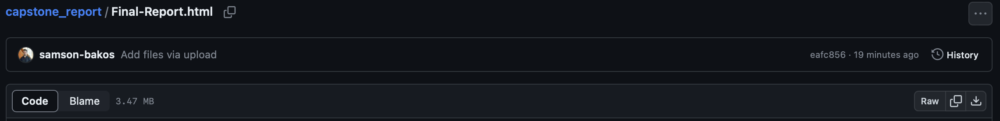

# Predicting Floods in Canadian Rivers

Repo for the final report for my UBC Master of Data Science Capstone Project, publicized with permission by BGC Engineering. Notebooks and Scripts created as part of the Data Product for this project are intellectual property of BGC Engineering and cannot be publicized. 

This report focuses on updating the statistical and machine learning techniques used to predict the magnitudes of the most potentially destructive floods in Canadian rivers. The baseline approaches described in this report are currently widely used in the Geotechnical Engineering and Hydrology industries, as outlined by the US Geological Survey. 

## Usage

Multiple report formats are provided here, including a locally rendering .md file. However, for best viewing, **please download the .html file.** 

To download, click on the .html file in the repo above, and click the download button, location shown shown in the **bottom right corner** of the screenshot below 

The file will appear in your downloads, and when opened (i.e. via double click) will show a rendered version of the report. 
